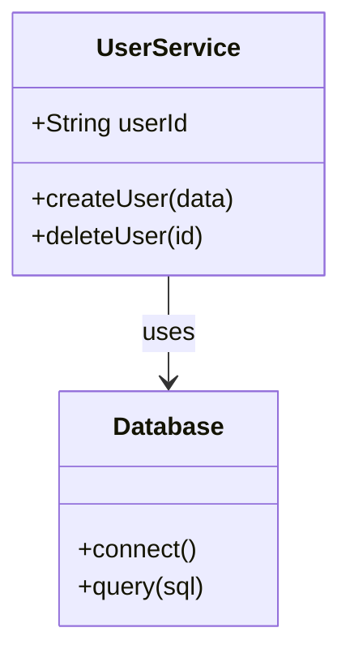

# Mermaid Class Diagram POC

A proof-of-concept Next.js application demonstrating Mermaid.js for UML class diagram visualization.

## 🚀 Quick Start

```bash
# Install dependencies (already done)
npm install

# Run development server
npm run dev
```

Open [http://localhost:3000](http://localhost:3000) to see the diagram.

## 📁 Project Structure

```
mermaid-diff-poc/
├── app/
│   ├── page.tsx              # Main page with class diagram
│   ├── layout.tsx            # Root layout
│   └── globals.css           # Global styles
├── components/
│   └── MermaidDiagram.tsx    # Reusable Mermaid component
└── package.json
```

## 🎯 Key Features Demonstrated

### ✅ Class Diagram Rendering
- Three classes: `UserService`, `Database`, `AuthService`
- Methods and properties displayed
- Relationships shown with arrows

### ✅ Component Architecture
- **MermaidDiagram** - Reusable client component
- Handles Mermaid initialization
- Error handling built-in
- TypeScript typed

### ✅ Styling
- Tailwind CSS for layout
- Dark mode support
- Responsive design

## 🔧 How It Works

### 1. MermaidDiagram Component
```typescript
// components/MermaidDiagram.tsx
'use client';

import mermaid from 'mermaid';

export default function MermaidDiagram({ chart }: { chart: string }) {
  // Initialize Mermaid
  mermaid.initialize({
    startOnLoad: false,
    securityLevel: 'loose', // Required for click events
  });
  
  // Render diagram
  const { svg } = await mermaid.render('id', chart);
  
  return <div dangerouslySetInnerHTML={{ __html: svg }} />;
}
```

### 2. Using in Pages
```typescript
// app/page.tsx
const classDiagram = `classDiagram
  class UserService {
    +createUser()
    +deleteUser()
  }
`;

return <MermaidDiagram chart={classDiagram} />;
```

## 📝 Mermaid Syntax Example



## 🎨 Next Steps for Diff Visualization

### Add Color-Coded Diffs
```typescript
const diffDiagram = `classDiagram
    class AddedClass:::added
    class ModifiedClass:::modified
    class DeletedClass:::deleted
    
    classDef added fill:#90EE90,stroke:#228B22
    classDef modified fill:#FFE4B5,stroke:#FFA500
    classDef deleted fill:#FFB6C1,stroke:#DC143C
`;
```

### Add Method Click Handlers
```typescript
useEffect(() => {
  // Add click handlers to methods after rendering
  document.querySelectorAll('.method').forEach(method => {
    method.addEventListener('click', () => {
      console.log('Method clicked:', method.textContent);
      // Navigate to sequence diagram
    });
  });
}, [svg]);
```

## 📦 Dependencies

- **Next.js 15** - React framework
- **Mermaid.js 10** - Diagram rendering (MIT license)
- **TypeScript** - Type safety
- **Tailwind CSS** - Styling

## 🎓 Learn More

- [Mermaid.js Docs](https://mermaid.js.org/)
- [Class Diagram Syntax](https://mermaid.js.org/syntax/classDiagram.html)
- [Next.js Docs](https://nextjs.org/docs)

## 📄 License Notes

**Mermaid.js is MIT Licensed:**
- ✅ Use in commercial projects
- ✅ Modify source code
- ✅ Keep modifications private
- ✅ No need to open source your changes
- ⚠️ Must include MIT license text in distributed source

## 🚧 Future Enhancements

1. **Method-level interactivity** - Click methods to show sequence diagrams
2. **Diff visualization** - Color-code added/modified/deleted classes
3. **Zoom & pan** - Add diagram navigation controls
4. **Export** - Download diagrams as PNG/SVG
5. **Real-time editing** - Live preview while editing code
