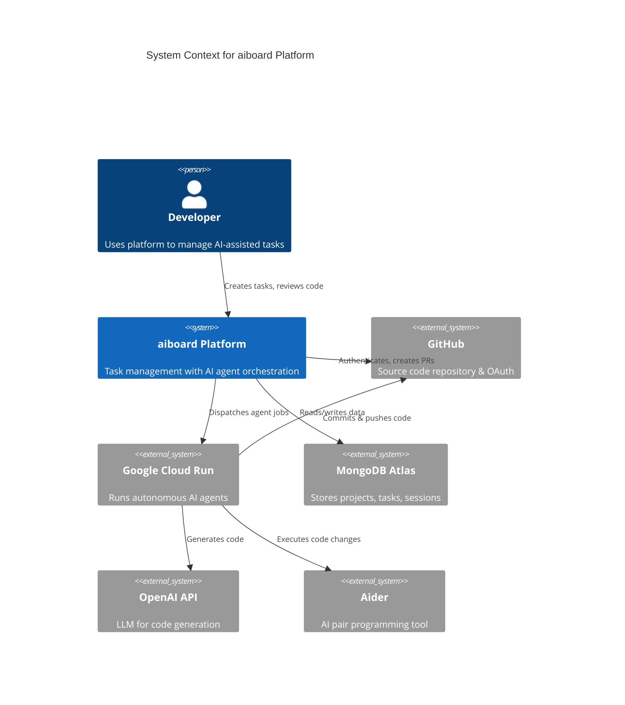
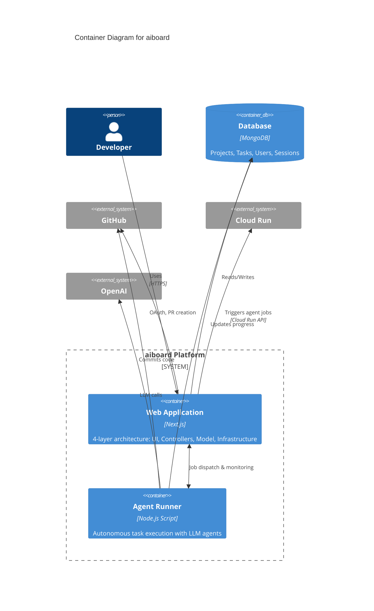
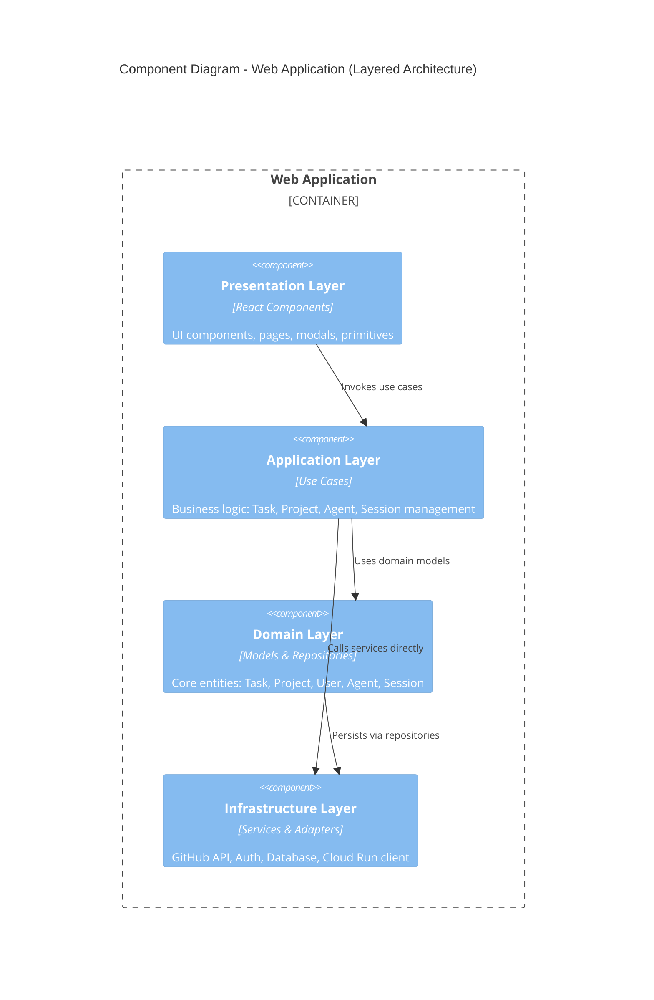
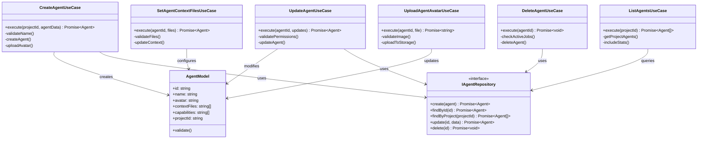
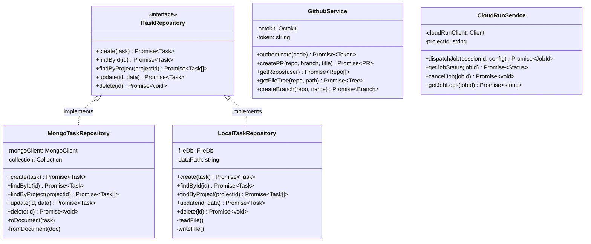

# Static Diagram Proposals for aiboard POC2

**Date:** May 28, 2026  
**Project:** Code Navigator - Living Documentation Platform  
**Codebase:** aiboard (AI-powered task management with layered architecture)

---

## 📐 Level 1: Use Case Diagram ✅ IMPLEMENTED

**Purpose:** Shows who uses the system and what they can do (focuses on user roles, use cases, and system boundary)

**Status:** ✅ Implemented in POC2 code-navigator

**What it shows:**
- **Actors:** Developer (primary user), AI Agent (automated), Team Lead (manager)
- **Use Cases:** 19 functional requirements grouped by domain
- **System Boundary:** aiboard Platform
- **Relationships:** Which actors can perform which use cases

**Domains:**
1. **Task Management** - Create, update, move tasks; set acceptance criteria and context files
2. **Agent Management** - Create, assign, configure, and monitor AI agents
3. **Task Execution** - Autonomous execution, code generation, PR creation (by AI Agent)
4. **Review & Approval** - Review changes, approve/reject sessions, provide feedback
5. **Project Management** - Create projects, manage team, view analytics

**Mock Changes (Diff Story):**
- 🟢 **Added (2):** "Set Task Context Files", "Configure Agent Context"
- 🟡 **Modified (2):** "Update Task", "Review AI Changes"
- ⚪ **Unchanged (15):** All other use cases

**Demo Story:** "AI agent added file context selection feature - developers can now specify which files the AI should focus on"

---

## 📐 Level 2: System Context Diagram (C4) - PLANNED

**Purpose:** High-level view showing aiboard system and its external dependencies



**Key Elements:**
- Developer as primary user
- aiboard as main system
- 5 external systems: GitHub, GCP, MongoDB, OpenAI, Aider
- Clear data and control flows

---

## 📐 Level 3: Container Diagram (C4) - PLANNED

**Purpose:** Shows major deployable units within aiboard system



**Key Elements:**
- 2 main containers: Web Application (Next.js) + Agent Runner (Node.js)
- MongoDB as persistent data store
- Separation of concerns: web UI vs background job execution
- Bidirectional communication between webapp and agent runner

---

## 📐 Level 4: Component Diagram (Web Application) - PLANNED

**Purpose:** Shows the 4-layer architecture inside the web application



**Key Elements:**
- **l1_ui:** React components from `src/l1_ui/`
- **l2_controllers:** Use cases from `src/l2_controllers/`
- **l3_model:** Domain models from `src/l3_model/`
- **l4_infra:** Services and repositories from `src/l4_infra/`
- Clean dependency flow with controller → infrastructure shortcut for services

---

## 📐 Level 5a: Class Diagram - Task Management - PLANNED

**Purpose:** Shows use cases and models for task management feature

```mermaid
classDiagram
    class CreateTaskUseCase {
        +execute(projectId, data) Promise~Task~
        -validateInput()
        -createTask()
        -notifyTeam()
    }
    
    class UpdateTaskUseCase {
        +execute(taskId, updates) Promise~Task~
        -validatePermissions()
        -updateTask()
    }
    
    class DeleteTaskUseCase {
        +execute(taskId) Promise~void~
        -checkDependencies()
        -deleteTask()
    }
    
    class MoveTaskUseCase {
        +execute(taskId, columnId) Promise~Task~
        -validateColumn()
        -reorderTasks()
    }
    
    class AssignWorkerUseCase {
        +execute(taskId, agentId) Promise~Task~
        -validateAgent()
        -assignAgent()
    }
    
    class SetAcceptanceCriteriaUseCase {
        +execute(taskId, criteria) Promise~Task~
        -validateCriteria()
        -updateAcceptance()
    }
    
    class SetTaskContextFilesUseCase {
        +execute(taskId, files) Promise~Task~
        -validateFiles()
        -updateContext()
    }
    
    class TaskModel {
        +id: string
        +title: string
        +description: string
        +status: TaskStatus
        +assignedAgentId: string
        +acceptanceCriteria: Criterion[]
        +contextFiles: string[]
        +validate()
    }
    
    class ITaskRepository {
        <<interface>>
        +create(task) Promise~Task~
        +findById(id) Promise~Task~
        +update(id, data) Promise~Task~
        +delete(id) Promise~void~
    }
    
    CreateTaskUseCase --> TaskModel : creates
    CreateTaskUseCase --> ITaskRepository : uses
    UpdateTaskUseCase --> TaskModel : modifies
    UpdateTaskUseCase --> ITaskRepository : uses
    DeleteTaskUseCase --> ITaskRepository : uses
    MoveTaskUseCase --> TaskModel : updates
    MoveTaskUseCase --> ITaskRepository : uses
    AssignWorkerUseCase --> TaskModel : assigns
    SetAcceptanceCriteriaUseCase --> TaskModel : validates
    SetTaskContextFilesUseCase --> TaskModel : configures
```



**Key Elements:**
- 7 use cases from `src/l2_controllers/task/`
- TaskModel from `src/l3_model/TaskModel.ts`
- ITaskRepository interface pattern
- Shows dependency on model and repository

---

## 📐 Level 5b: Class Diagram - Agent Management - PLANNED

**Purpose:** Shows use cases and models for AI agent management



**Key Elements:**
- 6 use cases from `src/l2_controllers/agent/`
- AgentModel from `src/l3_model/AgentModel.ts`
- Avatar upload handling
- Context file management

---

## 📐 Level 5c: Class Diagram - Infrastructure Layer - PLANNED

**Purpose:** Shows repository pattern implementation with multiple strategies



**Key Elements:**
- Repository pattern with interface
- MongoDB strategy from `src/l4_infra/strategies/mongodb/`
- Local file strategy from `src/l4_infra/strategies/local/`
- External service clients (GitHub, Cloud Run)
- Strategy pattern for swappable persistence

---

## 🎨 Mock Diff Data for Demo

### **Scenario: "AI Agent Added File Context Selection Feature"**

**Story:** The AI agent analyzed the codebase and added the ability to select specific files as context for tasks, spanning all architectural layers.

#### **Changes:**

**🟢 Added (Green):**
- `SetTaskContextFilesUseCase.ts` - New use case in l2_controllers/task
- `FileTreePickerModal.tsx` - New UI component in l1_ui/components
- `contextFiles` property in TaskModel

**🟡 Modified (Yellow):**
- `UpdateTaskUseCase.ts` - Added context file validation
- `TaskModel.ts` - Added contextFiles: string[] property
- `CreateTaskModal.tsx` - Integrated file picker
- `MongoTaskRepository.ts` - Updated schema

**🔴 Deleted (Red):**
- `LegacyFileSelector.tsx` - Replaced by new picker

**⚪ Unchanged (White):**
- All other task use cases
- Agent management
- Project management
- Session management

#### **Change Summary:**
```
Total: 8 files affected
  +2 files added
  ~5 files modified
  -1 file deleted
  
Layers affected:
  ✓ l1_ui (Presentation)
  ✓ l2_controllers (Application)
  ✓ l3_model (Domain)
  ✓ l4_infra (Infrastructure)
```

---

## 🎯 Implementation Plan

### **Phase 1: Static Diagrams (Current)**
1. ✅ Create all diagram definitions (Mermaid syntax)
2. Store in `src/data/c4-diagrams.ts`
3. Add diff metadata to each element

### **Phase 2: Rendering with Diff Colors**
1. Update MermaidDiagram component to parse elements
2. Apply CSS classes based on diff status
3. Add legends and change summaries

### **Phase 3: Navigation**
1. Wire up click handlers to drill down
2. Implement breadcrumb navigation
3. Sync with file tree selection

### **Phase 4: Polish**
1. Add hover tooltips with change details
2. Implement filter toggles (show/hide unchanged)
3. Add change timeline/history

---

## 📋 Diagram Metadata Structure

```typescript
interface DiagramElement {
  id: string;
  name: string;
  type: 'system' | 'container' | 'component' | 'class' | 'method';
  diff: {
    status: 'added' | 'modified' | 'deleted' | 'unchanged';
    linesAdded?: number;
    linesDeleted?: number;
    modifiedBy?: 'human' | 'ai-agent';
    timestamp?: Date;
    description?: string;
  };
  path?: string; // Link to actual code file
}

interface Diagram {
  level: 'context' | 'container' | 'component' | 'class';
  title: string;
  mermaidCode: string;
  elements: DiagramElement[];
  changesSummary: {
    added: number;
    modified: number;
    deleted: number;
    unchanged: number;
  };
}
```

---

## 🎨 Color Palette for Diff

```css
/* Based on standard git diff colors */
--diff-added: #22c55e;      /* Green - new elements */
--diff-modified: #eab308;   /* Yellow - changed elements */
--diff-deleted: #ef4444;    /* Red - removed elements */
--diff-unchanged: #e5e7eb;  /* Light gray - existing */
--diff-highlight: #3b82f6;  /* Blue - selected/focused */
```

---

**End of Static Diagram Proposals**

---

## ✅ Implementation Status (POC2)

### **Completed:**

**Level 1: Use Case Diagram**
- ✅ Created data structure in `src/data/diagrams.ts`
- ✅ 19 use cases across 5 domains
- ✅ 3 actors (Developer, AI Agent, Team Lead)
- ✅ Diff metadata with change summary (+2, ~2, 15 unchanged)
- ✅ Mermaid rendering with color-coded changes
- ✅ Legend showing added/modified/deleted/unchanged
- ✅ Change summary bar showing statistics
- ✅ Linked to actual code files (path property)
- ✅ Integrated into StaticView component
- ✅ Tab navigation (Use Cases, C4, Class)

**UI Components:**
- ✅ Change summary bar with counts
- ✅ Legend with color coding
- ✅ Tab switcher
- ✅ Zoom/fit controls (UI only)
- ✅ Sync status indicator

### **Demo Features:**
- **Story:** "AI Agent Added File Context Selection Feature"
- **Green boxes:** New use cases (Set Task Context Files, Configure Agent Context)
- **Yellow boxes:** Modified use cases (Update Task, Review AI Changes)
- **White boxes:** Unchanged use cases
- **Click navigation:** Ready for future drill-down

### **Files Created/Modified:**
```
poc2/code-navigator/
├── src/
│   ├── data/
│   │   └── diagrams.ts          ✅ NEW - Diagram data with diff
│   └── components/
│       └── StaticView.tsx        ✅ MODIFIED - Renders use case diagram
└── package.json                  ✅ MODIFIED - Added mermaid dependency
```

### **Next Steps:**
1. Add C4 diagrams (Context, Container, Component)
2. Add Class diagrams
3. Wire up click handlers for drill-down navigation
4. Add sequence diagrams to Dynamic View
5. Sync file tree selection with diagram highlighting

---
